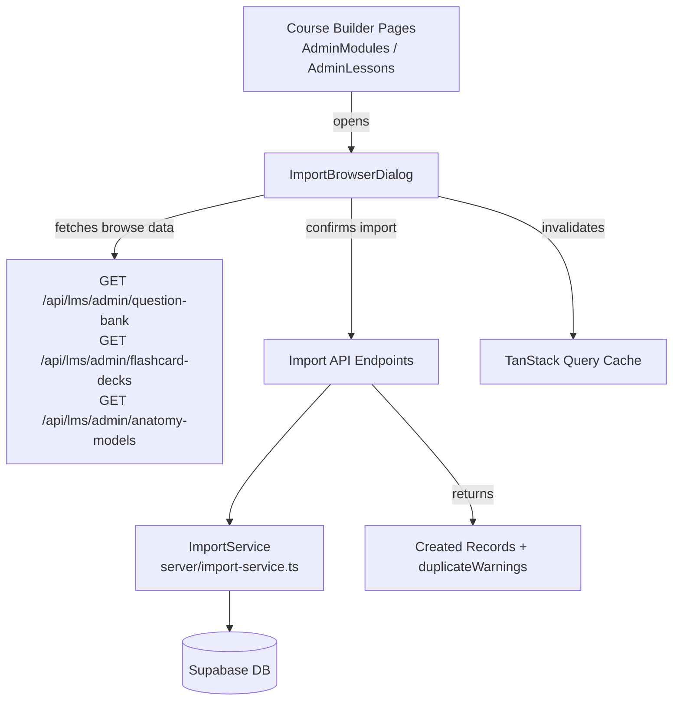

# Design Document: Course Content Import

## Overview

This feature adds an import mechanism to the Course Builder that lets admins and instructors pull existing content — questions from the Question Bank, flashcard decks/cards from the Flashcards module, and 3D anatomy models from the 3D Models module — directly into course content without leaving the editor.

The design centers on a reusable `ImportBrowserDialog` modal component that adapts its content type based on context, backed by a set of new API endpoints on the admin router. Questions and flashcards are **copied** (new records created), while 3D models are **reference-linked** (a join record pointing to the original `anatomy_models` row).

---

## Architecture



The import flow is:
1. User clicks an "Import" button in the course builder (lesson or quiz editor).
2. `ImportBrowserDialog` opens, fetches browsable content via existing read endpoints.
3. User searches/filters, selects items, and clicks "Import Selected".
4. Frontend calls the appropriate import endpoint.
5. `ImportService` on the backend copies or links the records, detects duplicates, and returns results.
6. TanStack Query cache is invalidated so the UI reflects the new content immediately.

---

## Components and Interfaces

### Frontend

**`ImportBrowserDialog`** — `client/src/components/admin/ImportBrowserDialog.tsx`

A single reusable modal that renders different content based on the `contentType` prop.

```typescript
type ImportContentType = 'questions' | 'flashcard-decks' | 'flashcards' | '3d-models';

interface ImportBrowserDialogProps {
  open: boolean;
  onOpenChange: (open: boolean) => void;
  contentType: ImportContentType;
  // Target context — only the relevant ones need to be provided
  targetQuizId?: string;
  targetCourseId?: string;
  targetModuleId?: string;
  targetLessonId?: string;
  targetDeckId?: string;  // for individual flashcard import
  onImportSuccess?: () => void;
}
```

Internal state:
- `searchQuery: string`
- `filters: Record<string, string>` (topic, difficulty, category, bodySystem)
- `selectedIds: Set<string>`
- `duplicateIds: Set<string>` — IDs flagged as potential duplicates

The component uses `useQuery` to fetch browsable content and `useMutation` to call the import endpoint. On success it calls `queryClient.invalidateQueries` for the relevant query keys and invokes `onImportSuccess`.

**Integration points in existing pages:**

- `AdminLessons.tsx` — adds "Import 3D Models" and "Import Flashcard Decks" buttons per lesson
- Quiz editor (within `AdminLessons.tsx`) — adds "Import from Question Bank" button per quiz
- `AdminModules.tsx` — adds "Import Flashcard Decks" button per module

### Backend

**`ImportService`** — `server/import-service.ts`

Encapsulates all import logic, keeping route handlers thin.

```typescript
interface ImportQuestionsResult {
  created: QuizQuestion[];
  duplicateWarnings: string[];
}

interface ImportFlashcardDecksResult {
  created: FlashcardDeck[];
  duplicateWarnings: string[];
}

interface ImportFlashcardsResult {
  created: Flashcard[];
  duplicateWarnings: string[];
}

interface ImportModelsResult {
  created: LessonAnatomyModel[];
  duplicateWarnings: string[];
}

class ImportService {
  importQuestionsToQuiz(quizId: string, questionIds: string[]): Promise<ImportQuestionsResult>
  importFlashcardDecksToTarget(courseId: string, deckIds: string[], moduleId?: string): Promise<ImportFlashcardDecksResult>
  importFlashcardsToDecks(targetDeckId: string, flashcardIds: string[]): Promise<ImportFlashcardsResult>
  importModelsToLesson(lessonId: string, modelIds: string[]): Promise<ImportModelsResult>
  importModelsToModule(moduleId: string, modelIds: string[]): Promise<ImportModelsResult>
}
```

**New routes** added to `adminRouter` in `server/lms-routes.ts`:

| Method | Path | Description |
|--------|------|-------------|
| POST | `/api/lms/admin/quizzes/:quizId/import-questions` | Import question bank items into a quiz |
| POST | `/api/lms/admin/courses/:courseId/import-flashcard-decks` | Import flashcard decks into a course (optional moduleId in body) |
| POST | `/api/lms/admin/flashcard-decks/:deckId/import-flashcards` | Import individual flashcards into a deck |
| POST | `/api/lms/admin/lessons/:lessonId/import-3d-models` | Link anatomy models to a lesson |
| POST | `/api/lms/admin/modules/:moduleId/import-3d-models` | Link anatomy models to a module |

---

## Data Models

### New Table: `lesson_anatomy_models`

3D model imports use reference linking. A new join table is needed:

```sql
CREATE TABLE lesson_anatomy_models (
  id          VARCHAR PRIMARY KEY DEFAULT gen_random_uuid(),
  lesson_id   VARCHAR REFERENCES lessons(id) ON DELETE CASCADE,
  module_id   VARCHAR REFERENCES course_modules(id) ON DELETE CASCADE,
  model_id    VARCHAR NOT NULL REFERENCES anatomy_models(id) ON DELETE CASCADE,
  "order"     INTEGER DEFAULT 0,
  created_at  TIMESTAMP DEFAULT NOW(),
  CONSTRAINT lesson_or_module CHECK (
    (lesson_id IS NOT NULL AND module_id IS NULL) OR
    (lesson_id IS NULL AND module_id IS NOT NULL)
  )
);
```

Drizzle schema addition in `shared/models/lms.ts`:

```typescript
export const lessonAnatomyModels = pgTable("lesson_anatomy_models", {
  id: varchar("id").primaryKey().default(sql`gen_random_uuid()`),
  lessonId: varchar("lesson_id").references(() => lessons.id, { onDelete: "cascade" }),
  moduleId: varchar("module_id").references(() => courseModules.id, { onDelete: "cascade" }),
  modelId: varchar("model_id").notNull().references(() => anatomyModels.id, { onDelete: "cascade" }),
  order: integer("order").default(0),
  createdAt: timestamp("created_at").defaultNow(),
});

export type LessonAnatomyModel = typeof lessonAnatomyModels.$inferSelect;
export type InsertLessonAnatomyModel = typeof lessonAnatomyModels.$inferInsert;
```

### Existing Tables Used (no schema changes)

| Table | Role in Import |
|-------|---------------|
| `question_bank` | Source for question imports |
| `question_bank_options` | Source for option copying |
| `quiz_questions` | Destination for copied questions |
| `quiz_options` | Destination for copied options |
| `flashcard_decks` | Source and destination for deck imports |
| `flashcards` | Source and destination for card imports |
| `anatomy_models` | Source (read-only) for model linking |

### Request/Response Shapes

**POST `/quizzes/:quizId/import-questions`**
```typescript
// Request
{ questionIds: string[] }

// Response 201
{
  created: QuizQuestion[],
  duplicateWarnings: string[]  // question texts that already exist in quiz
}
```

**POST `/courses/:courseId/import-flashcard-decks`**
```typescript
// Request
{ deckIds: string[], moduleId?: string }

// Response 201
{
  created: FlashcardDeck[],
  duplicateWarnings: string[]  // deck titles that already exist in target
}
```

**POST `/flashcard-decks/:deckId/import-flashcards`**
```typescript
// Request
{ flashcardIds: string[] }

// Response 201
{
  created: Flashcard[],
  duplicateWarnings: string[]
}
```

**POST `/lessons/:lessonId/import-3d-models`** and **POST `/modules/:moduleId/import-3d-models`**
```typescript
// Request
{ modelIds: string[] }

// Response 201
{
  created: LessonAnatomyModel[],
  duplicateWarnings: string[]  // model IDs already linked to target
}

// Response 422 (invalid IDs)
{ message: string, invalidIds: string[] }
```

---

## Correctness Properties

*A property is a characteristic or behavior that should hold true across all valid executions of a system — essentially, a formal statement about what the system should do. Properties serve as the bridge between human-readable specifications and machine-verifiable correctness guarantees.*

### Property 1: Import browser filtering correctness

*For any* set of content items and any combination of active filters (search term, topic, difficulty, category, body system), every item returned by the filter function must satisfy all active filter predicates, and no item that satisfies all predicates must be excluded.

**Validates: Requirements 2.2, 2.3, 2.4, 4.2, 4.3, 6.2, 7.2, 7.3, 7.4**

### Property 2: Question import creates exact copies

*For any* non-empty list of question bank item IDs imported into a quiz, the number of newly created `quiz_question` records must equal the number of input IDs, and each created record must have `question`, `questionType`, `explanation`, and `points` fields matching the source item.

**Validates: Requirements 3.1, 3.5**

### Property 3: Question option copying fidelity

*For any* question bank item with N options that is imported into a quiz, the resulting `quiz_question` must have exactly N associated `quiz_option` records, each with `optionText`, `isCorrect`, and `order` matching the corresponding source option.

**Validates: Requirements 3.2**

### Property 4: Import order assignment invariant

*For any* target container (quiz, flashcard deck, lesson, module) with an existing maximum order value M, and any import of K items, the newly created records must have order values M+1, M+2, ..., M+K assigned sequentially.

**Validates: Requirements 3.3, 6.4, 8.3**

### Property 5: Flashcard deck import creates copies with correct target IDs

*For any* non-empty list of flashcard deck IDs imported into a course (with optional moduleId), each newly created deck record must have `courseId` set to the target course ID, and if `moduleId` is provided, `moduleId` must also be set on the new record.

**Validates: Requirements 5.1, 5.2**

### Property 6: Flashcard card copying fidelity

*For any* flashcard deck with N cards that is imported, the newly created deck must have exactly N associated `flashcard` records, each with `front`, `back`, `cardType`, `options`, `correctAnswer`, `explanation`, `imageUrl`, `audioUrl`, and `order` matching the source card.

**Validates: Requirements 5.3**

### Property 7: 3D model import creates reference records

*For any* non-empty list of published anatomy model IDs imported into a lesson or module, the number of newly created `lesson_anatomy_models` records must equal the number of input IDs, and each record must reference the correct `modelId` and the correct `lessonId` or `moduleId`.

**Validates: Requirements 8.1, 8.2, 8.5**

### Property 8: Duplicate detection correctness

*For any* import operation where some selected items have content that already exists in the target (matching question text, deck title, or model ID), the response must include a `duplicateWarnings` array containing exactly those items, and the import must still complete successfully.

**Validates: Requirements 9.1, 9.2, 9.3, 9.4, 10.8**

### Property 9: Invalid ID rejection

*For any* import request containing a mix of valid and invalid IDs, the endpoint must return HTTP 422 and the response body must list exactly the invalid IDs — no more, no fewer.

**Validates: Requirements 8.4, 10.6**

---

## Error Handling

| Scenario | HTTP Status | Response |
|----------|-------------|----------|
| Unauthenticated request | 401 | `{ message: "Unauthorized" }` |
| Authenticated non-admin/instructor | 403 | `{ message: "Forbidden" }` |
| Malformed request body / missing required fields | 400 | `{ message: "<descriptive error>" }` |
| One or more IDs not found or not published | 422 | `{ message: "Invalid IDs", invalidIds: string[] }` |
| Target quiz/course/lesson/module not found | 404 | `{ message: "<entity> not found" }` |
| Successful import with duplicate warnings | 201 | `{ created: [...], duplicateWarnings: [...] }` |
| Successful import with no duplicates | 201 | `{ created: [...], duplicateWarnings: [] }` |

The `ImportService` validates all IDs before performing any writes. If any ID is invalid, the entire request is rejected with 422 — no partial imports.

---

## Testing Strategy

### Unit Tests (example-based)

- Auth middleware: unauthenticated → 401, non-admin → 403
- Malformed request body → 400
- Import with all-invalid IDs → 422 with correct `invalidIds`
- Import of empty-options question → question created + warning returned
- Import of empty flashcard deck → deck created + warning returned
- UI: import controls visible for admin role, hidden for non-admin
- UI: query cache invalidated after successful import

### Property-Based Tests

Use **fast-check** (TypeScript) for all property tests. Each test runs a minimum of 100 iterations.

```
Feature: course-content-import, Property 1: Import browser filtering correctness
Feature: course-content-import, Property 2: Question import creates exact copies
Feature: course-content-import, Property 3: Question option copying fidelity
Feature: course-content-import, Property 4: Import order assignment invariant
Feature: course-content-import, Property 5: Flashcard deck import creates copies with correct target IDs
Feature: course-content-import, Property 6: Flashcard card copying fidelity
Feature: course-content-import, Property 7: 3D model import creates reference records
Feature: course-content-import, Property 8: Duplicate detection correctness
Feature: course-content-import, Property 9: Invalid ID rejection
```

Properties 1–9 test pure logic functions extracted from `ImportService` and the filter utilities in `ImportBrowserDialog`. The Supabase client is mocked so tests run in-memory without database calls.

### Integration Tests

- End-to-end: POST to each import endpoint with a real (test) database, verify records created
- Verify `lesson_anatomy_models` table constraint (lesson_id XOR module_id)
- Verify cascade deletes: deleting a lesson removes its `lesson_anatomy_models` rows
